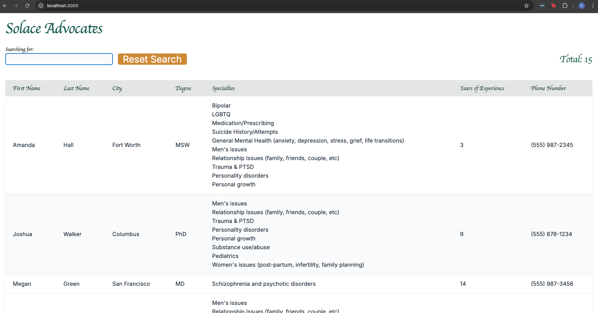
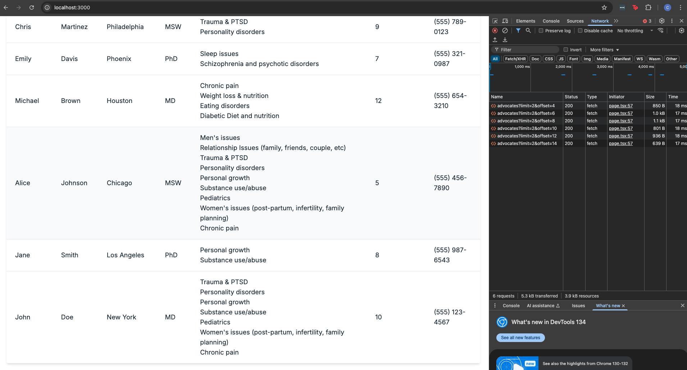
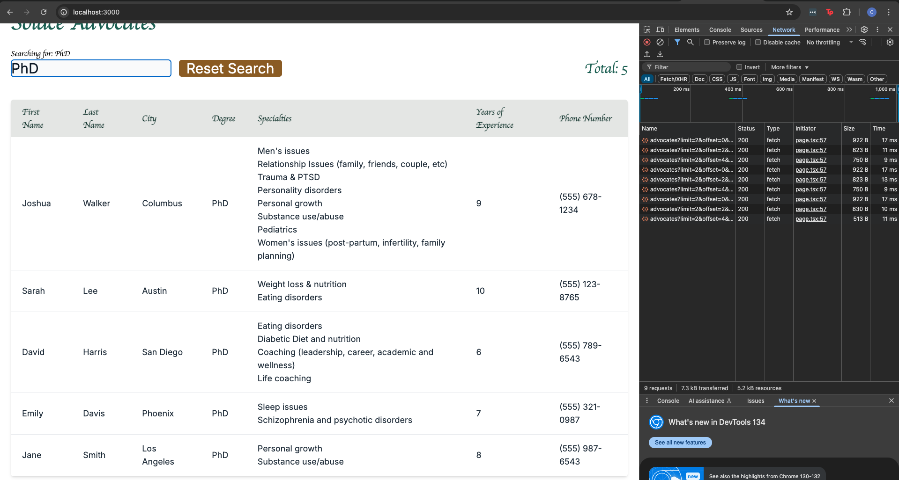

# Discussion

Hello!  Thank you for reviewing this coding assessment - I made a number of changes throughout many commits, so I've broken things out here below to provide a bit more clarity.  A complete diff of the code (save for the commit containing the final changes to this file) can be found at the link below:

https://github.com/abramicf/solace-candidate-assignment/compare/06ea9bb..296e796

NOTE: Some of the files marked as changed (.eslintrc.json, gitignore, .env) are part of the original repo with no changes made.  The bulk of the substantive changes are made in these files:

src/app/api/advocates/route.ts
src/app/globals.css
src/app/page.tsx
tailwind.config.ts

## One - Fixed Bugs

1.  Fixed hydration error that shows up on initial page load [in this commit](https://github.com/abramicf/solace-candidate-assignment/commit/2e616e07b55139bb8e8a77d1ada4543d811e4466)
2.  Fixed bug that occurs when trying to use 'includes' method on a string [in this commit](https://github.com/abramicf/solace-candidate-assignment/commit/592f688bd358301087f18db57fce9f52ea778d06).  NOTE - this code later on got moved to the backend and refactored, but this fixed the bug at the offset
3.  Looked into double call to the advocates endpoint that occur on initial page load.  This appears to be expected behavior that arises from running React in dev mode.
4.  Fixed issue where span and input box were not clearing when the Reset Search button was hit [in this commit](https://github.com/abramicf/solace-candidate-assignment/commit/ca3243f22d018e1a71324abf286ceb929b606f12).  NOTE - onClick later got refactored, but this fixed the bug at the offset
5.  Removed browser warning message [in this commit](https://github.com/abramicf/solace-candidate-assignment/commit/16ed419d6f664df226091e972b7ed5e5c55c43fd)

## Two - Added New Functionality

1.  After enabling the database, I set up lazy loading 'infinite scroll' for the table.  Once lazy loading was set up, I also set up backend filtering so that filtered results would be complete and lazy loaded as well.  I set the limit to 2 in order to test the functionality locally - generally a larger offset would be selected.  NOTE - backend searching/filtering is not yet available for specialties and phone numbers

This included changes to the advocates endpoint, which are documented below:

### GET /api/advocates
Fetches paginated advocate data with optional search functionality.

Query Parameters:
- `limit` (number): Number of records per page (default: 10)
- `offset` (number): Starting position for pagination (default: 0)
- `search` (string): Search term to filter results

Response Format:
```typescript
{
  data: Advocate[];
  pagination: {
    total: number;
    limit: number;
    offset: number;
  }
}
```

2.  More robust searching/filtering (ability to search case insensitive values)

## Three - Added formatting

1.  Used Solace website as a general guide
2.  Using Tailwind, formatted the page using Solace's colors, and highlighting the row when it's hovered over
3.  Made phone number more human readable (NOTE: The regex function that does this comes from Stack Overflow)
4.  Disabled button when text not entered into input and changed formatting when button was not disabled
5.  Added total count display
6.  Added capability for Mollie Glaston font, which appears to be Solace's signature font.  Files need to be purchased and downloaded and loaded into the app - app currently renders in backup 'cursive' font.

## Four - Demo

General formatting, highlighting of row when hovered over (second row down)


Paginated requests with lazy load on initial page load and scroll
NOTE:  Number of requests can be reduced by increasing the page limit - wanted to show multiple
requests for demo purposes.


Paginated requests with lazy load when searching/filtering, and reset search enabled when content in the text input.
NOTE:  Number of requests can be reduced by increasing the page limit and the debouncing interval - wanted to show multiple
requests for demo purposes.



## Five - What I would work on next

1.  There appears to be a needless rerender on initial page load.  It's subtle but it's there.  Also,
it would be nice to have the table header be of fixed width, so that width does not change when the data get returned
2.  Enable backend filtering on phone number and specialities
3.  For readability and reusability I'd have simple subcomponents that create the individual th and td elements so that the formatting does not need to be repeated
4.  There is likely additional simplification in the formatting using Tailwind that can be accomplished through inheritance
5.  Download the Mollie Glaston font (currently the urls return 404 because the files are not present because they need to be purchased)
6.  Further increase the debounce on search to further limit calls to the API
7.  It would be good to have the table header row be 'sticky' so that is remains place during scrolling
8.  Error handling on the advocates endpoint

Thank you for taking the time to review!

